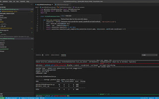
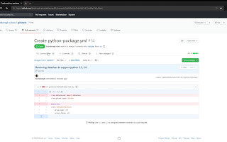

# Coding Best Practices

## Understand and create SOLID software

[Good testing](./testing.md) requires that your code be properly organized.  The concepts that make up good, testable code are [SOLID](https://en.wikipedia.org/wiki/SOLID):

- Single-responsibility principle
    - A class should only have a single responsibility, that is, only changes to one part of the software's specification should be able to affect the specification of the class.
- Open–closed principle
    - "Software entities ... should be open for extension, but closed for modification."
- Liskov substitution principle (program to the interface)
    - "Objects in a program should be replaceable with instances of their subtypes without altering the correctness of that program." See also design by contract.
- Interface segregation principle
    - "Many client-specific interfaces are better than one general-purpose interface."
- Dependency inversion principle
    - One should "depend upon abstractions, [not] concretions."

Together, these allow creating maintable software where you can substitute simple chunks of code (called mocks) to replace complex interfaces between code boundaries.  This is especially important when your code interfaces with external systems you have no control over, as you can simulate those systems and run tests quicklky and reliably.

[**Video: Implementing the First Feature**    ](https://drive.google.com/file/d/1Gejl7be0UgtZZe8wL9J0IQM7weZ7RqTk/view?usp=sharing "Video: Implementing the First Feature")

[**Video: Testing your Code with Unit Tests and Mocks**    ](https://drive.google.com/file/d/1RNMUShsrPl4Ubylp6KHCHnXs97c18_2j/view?usp=sharing "Video: Testing your Code with Unit Tests and Mocks")

## Use Tests to Inform Your Decisions

[Testing](./testing.md) is an excellent way to inform decisions.  Using tests, you can explore different possibilties for your code and expose edge cases.  By writing tests for all aspects of your code, preferably early in your development process, you can expose logical issues with your requirements.  If you can't think of a good way to test your code, it's probably going to be very difficult to write!

[**Video: Using Tests to Inform Decisions**    ](https://drive.google.com/file/d/1C96T5vUWZaAG6RtsR0b7yvmoTf-Sd-TF/view?usp=sharing "Video: Using Tests to Inform Decisions")

## Make isolated changes and simple PRs

The more complicated a Pull Request gets, the more difficult it will be to get buy-in from the team.  Very small PRs have a lot of advantages, not the least of which is that they are easy to review.  If you need to review a 50 line PR and a 5,000 line PR, which one are you going to look at first?  Also, if your PR contains only a single feature, that feature can be accepted in isolation of other changes.  If, for example, a PR has both a new feature and a bug fix, what happens if you need the bug fix quickly but are not sure the feature is ready to ship?  Conversely, if a change introduces a bug to production, but the PR contained many features, how are you going to revert just the feature that contains the bug?

[**Video: Isolating Changes and Making Good PRs**    ](https://drive.google.com/file/d/10Nk_DOStB9W1cFrYtx28y05y3lZI6FHl/view?usp=sharing "Video: Isolating Changes and Making Good PRs")