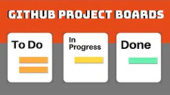

# Project Dashboard

The [Project Board](https://docs.github.com/en/github/managing-your-work-on-github/about-project-boards) helps you to manage the lifecycle of issues.  You will create a single *Basic Kanban* project board, which has three columns, and then add a Backlog column.

[**Video: Setting up your Project Dashboard**    ](https://www.youtube.com/embed/ff5cBkPg-bQ?end=379 "Video: Setting up your Project Dashboard")

During the [sprint planning](./planning.md) meetings, you will maintain this board to keep track of your team's highest-priority features, and assign them to team members to work on.  A team member can be assigned only one feature at a time, and that feature must be worked on until it is complete; a feature is complete when it is either implemented or abandoned.

The columns are used for the following:

- **Backlog** contains issues which are prioritized but need refinement through the addition of acceptance criteria and validation techniques.
- **To Do** contains issues which are prioritized and refined (acceptance criteria and validation techniques defined) but are not yet being actively worked on.
- **In Progress** contains issues which are actively being worked on this sprint, but are not yet completed.  This column should be filled at the start of each sprint (with 2 [issues](./issues.md) and one feature per team member).  Tasks, chores, and exploration issues should all be completed by the end of the sprint; features are not necessarily completed at the end of a sprint (their work can span several sprints).
- **Done** contains issues which are already complete, and meet the [definition of done](./agile.md).
