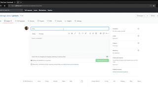
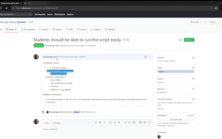
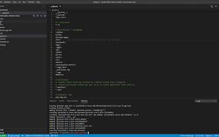
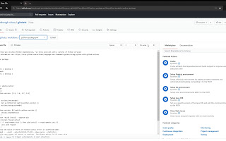

# Issue Management in GitHub

One of the key components of [Kanban](https://en.wikipedia.org/wiki/Kanban_(development)) is high visibility of the work being embarked upon.  This allows the team, management, or client to see quickly and easily the plan and progress.  In this project, we will achieve visibility through [GitHub Issues](https://guides.github.com/features/issues/).

# Types of Issues

Delete the default labels and create labels for the following four types of issues.  They will be used to track progress.

## Feature

A feature is a [user story](https://www.productplan.com/glossary/user-story/), and consists of a description of the user(s) ability to complete certain goals using the system.

[**Video: Logging Feature Requests**    ](https://drive.google.com/file/d/1n7Bbgr6DBXDGgLoNifwTASSe8wax3e9g/view?usp=sharing "Video: Logging Feature Requests")

A feature is broken down into Tasks, Exploration, and Chores (as defined below); each of these items should be expected to take 2-4 hours to complete, and should be [**SMART**](https://en.wikipedia.org/wiki/SMART_criteria):
 - **Specific** – target a specific area for improvement.
 - **Measurable** – quantify or at least suggest an indicator of progress.
 - **Assignable** – specify who will do it.
 - **Realistic** – state what results can realistically be achieved, given available resources.
 - **Time-related** – specify when the result(s) can be achieved.

[**Video: Refining a Feature Request**    ](https://drive.google.com/file/d/17cMkPLJP-gDVU5IFERgi_2Vo0Ff8PqgO/view?usp=sharing "Video: Refining a Feature Request")

## Task

A task is a step in the process to completing a feature.  A feature is completed when underlying tasks are completed.  Usually, tasks will include many aspects such as coding, testing, and documentation.  The task should be fully contained, such that all aspects of delivering the task are in a single issue.  In short, you should not have a coding task and a separate documentation task; they should be completed and delivered at the same time.

## Exploration

Exploration is required when breaking a feature into tasks is not possible, either because you are unclear what needs to be done or unclear how it should be accomplished.  These exploration tasks should be embarked upon early to limit risk to the project and/or time invested in features which turn out to be too complex to be worth completing.

## Chore

A [chore](https://scrumdictionary.com/term/chore/) is an item which provides value to the team rather than the client.  Examples include implementing [continuous integration](https://en.wikipedia.org/wiki/Continuous_integration), [linting](https://en.wikipedia.org/wiki/Lint_(software)) the project, or [refactoring a codebase](https://en.wikipedia.org/wiki/Code_refactoring). 

Generally, the client doesn't care whether or not a chore is completed.  They can be seen as implementation details from their perspective.  However, chores can create tools which speed up development.  They should be embarked upon if the return-on-investment is high; that is, over the life of the project, completion of the chore will save more time than the work it took to implement.

Two very common chores are described in the below videos.

[**Video: Deployable Artifacts**    ](https://drive.google.com/file/d/1JdmV03vOxWLYWSVmAgdGr2e1YN7ff-5e/view?usp=sharing "Video: Deployable Artifacts")

[**Video: Implementing Continuous Integration**    ](https://drive.google.com/file/d/1hlTaBNjvvH14oY4eSOJkMBSWrICa70si/view?usp=sharing "Video: Implementing Continuous Integration")
