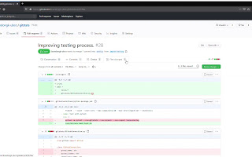
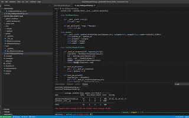

# Testing Your Code

Testing your code is an important part of the software development process.  It is required for you, your team, and your client to know that your feature is working as expected.  The first step in testing your code is to determine what you want the code to do, which is accomplished in [planning](./planning.md).  Without a good vision of what the software needs to do, it's impossible to test.  Another important concept is to make sure that changes are isolated so that they can be managed independently.  The goal of software testing is to build confidence in your code as quickly and cheaply as possible.

[**Video: Isolating Changes and Making Good PRs**   ](https://drive.google.com/file/d/10Nk_DOStB9W1cFrYtx28y05y3lZI6FHl/view?usp=sharing "Isolating Changes and Making Good PRs")

[**Video: Testing Your Code with Unit Test and Mocks**   ](https://drive.google.com/file/d/1RNMUShsrPl4Ubylp6KHCHnXs97c18_2j/view?usp=sharing "Testing Your Code with Unit Tests and Mocks")

There are [several levels](https://www.youtube.com/watch?v=QQj4R8YEWOs) at which your software can be tested at, and they all accomplish different goals.

- [**Unit Testing**](https://www.youtube.com/watch?v=3kzHmaeozDI) The unit is the smallest bit of code in the system, a single function or class, which accomplishes a specific, small purpose.  Unit testing, on its own, does not guarantee that the software meets the requirements of the client.  Instead, unit testing guarantees that the code meets the requirements of the developer, or the development team.  In a very basic sense, you are testing that given a specific input, the function or class produces a specific output.  Unit testing makes heavy use of *mocks* to isolate code for testing.
- **Integration Testing** Integration testing validates the combination of several units in the system.  Here, the tests guarantee that, when multiple parts of the system are combined, specific inputs produce specific outputs.  Because multiple units are combined, there are fewer *mocks* used at this level of testing.
- **System Testing**  System (or end-to-end) testing validates that the full system together works as expected.  There are many forms of system testing, but the most intuitive is functional testing, validating that the system functions as expected.  Other examples are: load testing, validating how the system performs under load; and usability testing, validating that the system is easy to use.
- **Acceptance Testing**  This is the highest level of testing, presenting the full system to the client or end users, and allowing them to test the software.

System and acceptance testing are easy to envision but expensive to run.  For example, when testing the login process of an application, the system test would involve running the application and trying to login.  Technically, this means deploying the entire application, which can include the webserver, a database, and possibly even more pieces.  A user who is able to login then needs to be created in the system, and someone needs to load the application and actually perform the login.  To make sure that the system is functioning at all times, the tests should be run every time the code changes, and this can be very time consuming.

Looking at the login process a bit deeper, we can see that being able to login is not the only thing we want to validate.  If the user enters the incorrect login information, we would expect the user to not be logged in and to receive an  error message.  If the user inputs unicode characters or emojis, we would expect the server to handle it gracefully.  If the user attempts multiple logins in quick succession, we might suspect some form of attack and an appropriate system response.  Testing all of these combinations by inputting text into a field is repetitive and time consuming.

Unicode characters and emojis can easily be tested at the unit level, by simulating a login request and invoking the code to handle the login request, without ever starting the webserver or submitting a form.  Because we don't need to start the full system, starting and running these tests is very fast; in fact, we could test hundreds or even thousands of possibilities in a few milliseconds!  We could even mock the database responses to be able to handle different use cases of success, failure, etc. quickly and easily.  Remember, though, that to make sure that the web server and database are connected correctly deployed, we would still need to run a [Smoke Test](https://en.wikipedia.org/wiki/Smoke_testing_(software)), or a very simple login attempt in a working environment before releasing.  Now, our many manual test cases have become one, and we have reasonable confidence that the login method is working before ever going through the effort of spinning up an environment.

Good testing requires that your code be properly organized.  The concepts that make up good, testable code are [SOLID](https://en.wikipedia.org/wiki/SOLID):

- Single-responsibility principle
    - A class should only have a single responsibility, that is, only changes to one part of the software's specification should be able to affect the specification of the class.
- Open–closed principle
    - "Software entities ... should be open for extension, but closed for modification."
- Liskov substitution principle (program to the interface)
    - "Objects in a program should be replaceable with instances of their subtypes without altering the correctness of that program." See also design by contract.
- Interface segregation principle
    - "Many client-specific interfaces are better than one general-purpose interface."
- Dependency inversion principle
    - One should "depend upon abstractions, [not] concretions."

